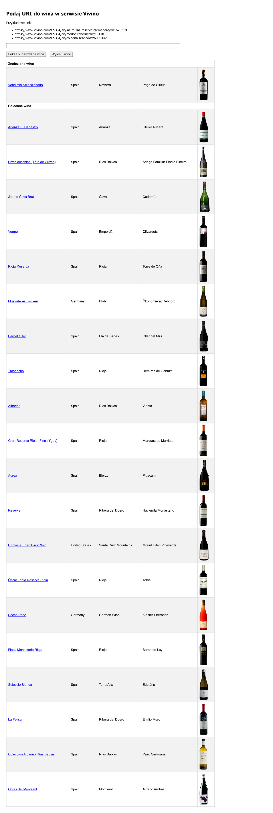

# Rekomendacja win z bazy Vivino.com

**Aplikacja na podstawie wskazanego wina za pomocą URLa ze strony vivino.com, przedstawia inne rekomendowane wina.**

Aplikacja napisana z wykorzystaniem frameworka FLASK.

Dane informacyjne o winach zostały zebrane dzięki scrapingowi *vivino.com* i znajdują się w pliku <a target='_blank' href='vivino-info.csv'>vivino-info.csv</a>.

Określanie podobnych win odbywa się z wykorzystaniem metryki odległości euklidesowej na podstawie modelu danych znajdującego się w archiwum <a target='_blank' href='vivino-out.zip'>vivino-out.zip</a>. 

